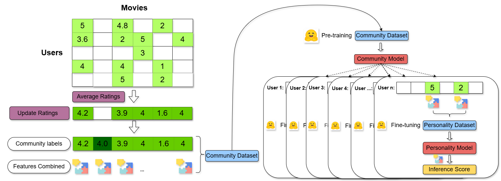
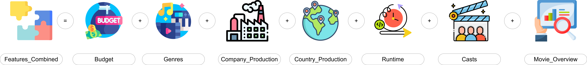

# 🤗 C2P FROM COMMUNITY TO PERSONALITY RECOMMENDATION SYSTEM 🤗 

## Overview

This repository contains the implementation of the C2P recommendation system, which aims to provide personalized movie recommendations by combining community ratings with individual user preferences. The C2P architecture addresses the challenge of making accurate recommendations for users who have rated too few items or are new to the system.

## Table of Contents

- [Introduction](#introduction)
- [Architecture](#architecture)
- [Datasets](#datasets)
- [Installation](#installation)
- [Results](#results)
- [Contributing](#contributing)
- [License](#license)

## Introduction

With the continuous development in the field of recommendation systems, providing personalized product recommendations tailored to individual users’ preferences has become increasingly accurate. However, limitations arise when users rate too few items or are new users. To overcome this issue, we propose the C2P (From Community to Personality Recommendation System) architecture.

C2P comprises two main stages:
1. **Community Model**: Aggregating the average ratings of all users to create a Community Model through fine-tuning.
2. **Personality Model**: Parallel fine-tuning for each user using their labeled ratings from previously rated items to uncover their unique personality traits.

## Architecture

The architecture of the proposed recommendation system involves utilizing Hugging Face’s models for a regression task trained on the Community dataset to establish the Community model. Then, this model is fine-tuned to create the Personality model. Predicted ratings are generated by passing combined features of the movie to the user’s personality model.



### Feature Combination

Features representing a movie are created by combining multiple factors such as budget, genres, production company, production country, runtime, casts, and movie overview.



## Datasets

The datasets used in this study are:

1. **Community Dataset**: Used to pre-train the Community model.
2. **Personality Dataset**: Used for fine-tuning the Personality model for each user.

## Installation

To set up this project locally, follow these steps:

1. Clone the repository:
    ```sh
    git clone https://github.com/yourusername/C2P-Recommender-System.git
    ```
2. Navigate to the project directory:
    ```sh
    cd C2P-Recommender-System
    ```

## Results

Our architecture surpasses several existing models, achieving the best results with:
- MSE = 0.893
- RMSE = 0.940

The detailed results and comparisons are provided in the paper.

## Contributing

We welcome contributions from the community. Please follow these steps to contribute:

1. Fork the repository.
2. Create a new branch (`git checkout -b feature-branch`).
3. Commit your changes (`git commit -am 'Add new feature'`).
4. Push to the branch (`git push origin feature-branch`).
5. Create a new Pull Request.

## License

This project is licensed under the MIT License - see the [LICENSE](LICENSE) file for details.

---

For more details, please refer to the paper or contact the authors at [sonnyinkai@gmail.com](mailto:sonnyinkai@gmail.com)
